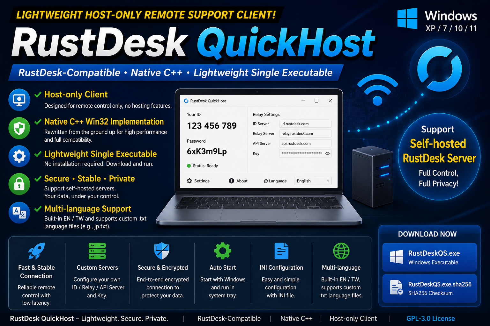
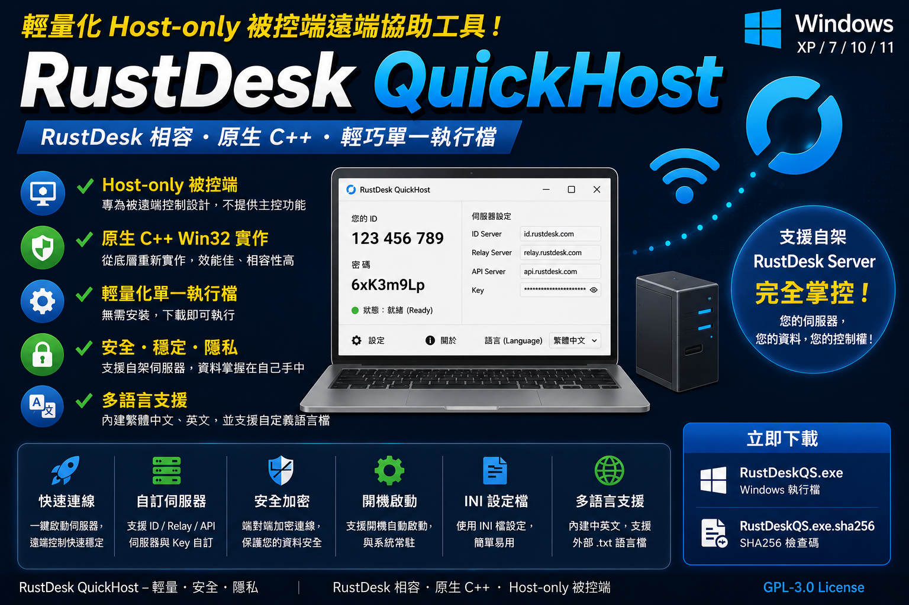

# RustDesk QuickHost

Native C++ host-only RustDesk-compatible remote support client for Windows XP / 7 / 10 / 11.


[Releases](https://github.com/Terence0816/RustDesk-QuickHost/releases) |
[Latest Official Build v1.1.2.3](https://github.com/Terence0816/RustDesk-QuickHost/releases/tag/v1.1.2.3) |
[GPL-3.0 License](LICENSE)

English | [繁體中文](#繁體中文)



RustDesk QuickHost is a lightweight **RustDesk-compatible host-only remote support client** for Windows.

It is rewritten from the ground up in native C++ and is designed for computers that only need to be remotely controlled.

> This project is compatible with RustDesk-style remote support usage, but it is **not an official RustDesk client**.

## Version History

### v1.1.2.3

* Fixed bidirectional file copy and paste support.
  * Files copied from the controller side using the right-click context menu can now be pasted and transferred to the host side.
  * Files copied from the host side can also be pasted and transferred back to the controller side.

* Improved clipboard synchronization.
  * Clipboard synchronization is no longer limited to plain text only.
  * Rich text content and text formatting attributes can now be synchronized in both directions when supported by the source application.

### v1.1.2.2

* Updated the auto-start behavior.
  * When launched automatically on Windows startup, the program now starts directly in the system tray without showing the main window.

* Added support for multiple controller connections.
  * Multiple controller clients can now connect to and operate the host at the same time.

* Improved clipboard synchronization.
  * Clipboard content is now synchronized in both directions, instead of only from the controller side to the host side.

* Fixed a Windows XP system tray issue.
  * Fixed an issue where the tray hide/show status could be incorrect on Windows XP.

### v1.1.2.1

* Fixed an issue where file transfer from the controller side to the host side could fail.
* Adjusted the incoming connection status window text.
  * Shortened the English and Traditional Chinese messages to prevent the text from being clipped when the message was too long.

### v1.1.2.0

* Optimized parts of the program code to improve stability and maintainability.
* Added support for the official RustDesk file transfer feature.
  * In addition to the existing local copy / paste file transfer method, files can now also be transferred using the standard RustDesk file transfer function from the controller side.
* Added an About option.
  * Users can easily view the current version, project information, license information, and update details.

### v1.1.0.0

* Added direct IP connection mode.
* Added configurable direct IP connection port.

  * Default port: `21118`
  * The port can be customized in `rustdesk_cpp_host.ini`.
* Added incoming connection status display.

  * Displays the connected peer by RustDesk ID or IP address.
* Added disconnect button in the main interface.

  * The host user can manually disconnect the current remote session.
* Improved host-side connection visibility.
* Video codec selection is automatic.

  * Currently supports H.264 and VP8.

### v1.0.0.0

* Initial public release.
* Native C++ Win32 host-only implementation.
* Supports Windows XP / Windows 7 / Windows 10 / Windows 11 and WinPE.
* Tested and confirmed to run and connect successfully in Windows XP / 7 / 10 / 11 PE environments.
* Added system tray resident mode.
* Added auto start with Windows.
* Added fixed password support.
* Added option to disable random one-time password.
* Added custom RustDesk ID support.
* Added INI-based RustDesk server configuration.
* Added self-hosted RustDesk server support.
* Added built-in Traditional Chinese and English language templates.
* Added custom `.txt` language file support.

## How to Use

1. Download `RustDeskQS.exe` on the Windows computer that needs to be remotely controlled.
2. Put the executable in a fixed folder and run it.
3. On first launch, the program automatically generates `rustdesk_cpp_host.ini`, `en.txt`, and `tw.txt`.
4. Provide the displayed ID and one-time password to the helper.
5. You may also configure a custom ID, fixed password, startup option, direct IP connection port, and self-hosted RustDesk server settings.
6. The controller side can use the official RustDesk client to connect.

## Suitable Use Cases

* Older Windows systems where many modern remote support tools no longer work.
* Windows PE maintenance, recovery, or temporary remote support environments.
* Computers that only need to be remotely controlled.
* Lightweight portable host-side remote support.
* Users who want to avoid commercial remote software limits.
* Self-hosted RustDesk Server deployments that need a simple host-only client.
* LAN environments that need direct IP connection support.

## Highlights

* Native C++ Win32 implementation
* Host-only remote support client
* Lightweight single executable
* Supports Windows XP / Windows 7 / Windows 10 / Windows 11 and WinPE.
* Tested and confirmed to run and connect successfully in Windows XP / 7 / 10 / 11 PE environments.
* System tray resident mode
* Auto start with Windows
* Fixed password support
* Option to disable random one-time password
* Custom RustDesk ID
* Direct IP connection mode
* Configurable direct IP connection port
* Incoming connection status display
* Displays connected peer ID or IP address
* Disconnect current session from the host UI
* INI-based configuration
* Custom ID server, relay server, API server and server key
* Self-hosted RustDesk server support
* Force relay option
* Automatic video codec detection
* Currently supports H.264 and VP8
* FPS and bitrate configuration
* Built-in Traditional Chinese and English language files
* Custom `.txt` language file support
* First run automatically generates `rustdesk_cpp_host.ini`, `en.txt`, and `tw.txt`

## Repository Layout

* `src/`: main native C++ Win32 source code
* `resources/`: application icons and UI resources
* `assets/screenshots/`: README screenshots
* `docs/`: technical notes
* `rustdesk_cpp_host.ini.example`: sample runtime configuration

Local/private build scripts are intentionally not included because they are specific to the author's local build environment.

## Screenshots

### v1.1.0.0 Incoming Connection Status


### Windows XP English UI


### Windows 7 English UI


### Custom Japanese Language Example


The screenshot above demonstrates a Japanese UI created by manually translating the built-in `tw.txt` or `en.txt` language template into a custom `jp.txt` file.
Users can create their own language file for other languages without rebuilding the program.

## INI Configuration

On first run, the program automatically generates:

```text
rustdesk_cpp_host.ini
en.txt
tw.txt
```

The default `rustdesk_cpp_host.ini` connects to the official RustDesk public server.

You can edit `id_server`, `relay_server`, `api_server`, and `key` to use your own self-hosted RustDesk server.

Direct IP connection port can also be customized in the INI file.
The default direct IP connection port is `21118`.

Video codec selection is automatic. The current version supports H.264 and VP8.

Example:

```ini
[server]
id_server=rs-ny.rustdesk.com:21116
relay_server=rs-ny.rustdesk.com:21117
api_server=
key=

[host]
id=
language_file=tw.txt
temporary_password_length=6
random_password_enabled=1
fixed_password_protected=
force_relay=1
direct_ip_port=21118
video_fps=30
video_bitrate_kbps=20000
```

## Direct IP Connection

RustDesk QuickHost supports direct IP connection mode.

This mode is useful when the host computer and the controller are on the same LAN, or when the host can be reached directly through IP and port.

Default direct IP port:

```text
21118
```

If the host is behind NAT or a firewall, port forwarding or firewall rules may be required.

## Language Files

Language files are simple `.txt` files.

Built-in templates:

```text
tw.txt
en.txt
```

To create another language, copy one of the generated language templates and translate only the values on the right side.
Keep the keys on the left side unchanged.

Example:

```ini
tray_show_main=Show Main Window
tray_exit=Exit
```

To use a custom Japanese file, save it as:

```text
jp.txt
```

Then select `jp.txt` from the program language menu, or set it manually in `rustdesk_cpp_host.ini`:

```ini
language_file=jp.txt
```

## Download

* Release page: [Releases](https://github.com/Terence0816/RustDesk-QuickHost/releases)
* Official `v1.1.2.3` build: [RustDeskQS.exe](https://github.com/Terence0816/RustDesk-QuickHost/releases/tag/V1.1.2.3)
* GitHub release assets show the current download count for the official build.

## Security Notice

RustDesk QuickHost is a remote support host-only tool.

Because it includes remote control, network connection, password, system tray resident mode, auto-start, and direct IP connection features, some antivirus engines may classify it as a risk tool or produce a false positive.

Please download only from the official GitHub Releases page and verify the digital signature and SHA256 checksum before use.

## Search Keywords

RustDesk compatible host, RustDesk host-only client, RustDesk QuickHost, remote support client, remote desktop host, self-hosted RustDesk server, direct IP connection, Windows XP remote support, Windows 7 remote support, native C++ Win32 remote desktop, custom language txt, INI configuration, RustDesk relay server, RustDesk ID server, H.264, VP8

## Disclaimer

This project is an independent implementation.

It is not affiliated with, endorsed by, or officially maintained by RustDesk.
RustDesk is a trademark of its respective owner.

Use this software only on computers you own or have permission to access.

This tool is intended only for authorized remote support. Do not use it for unauthorized access, stealth deployment, or any malicious activity.

## License

This repository is released under the GNU General Public License v3.0. See [LICENSE](LICENSE).

---

# 繁體中文



RustDesk QuickHost 是一個輕量化的 **RustDesk 相容 Host-only 被控端遠端協助工具**。

本專案使用原生 C++ 從底層重新實作，主要設計給只需要被遠端連線控制的 Windows 電腦使用。

> 本專案相容 RustDesk 風格的遠端協助用途，但不是 RustDesk 官方用戶端。

## 版本更新紀錄

### v1.1.2.3

* 修復檔案雙向複製與貼上傳輸功能。
  * 主控端透過右鍵選單複製檔案後，現在可以貼上並傳送到被控端。
  * 被控端複製檔案後，也可以反向貼上並傳送到主控端。

* 改善剪貼簿同步功能。
  * 剪貼簿同步不再只支援純文字內容。
  * 現在可將富文字內容與文字格式屬性一起進行雙向同步，實際效果依來源程式支援的剪貼簿格式而定。

### v1.1.2.2

* 更新開機自動啟動行為。
  * 當程式於 Windows 開機後自動啟動時，會直接進入右下角系統列，不會顯示主畫面。

* 新增多主控端連線支援。
  * 現在可讓多個主控端同時連入並操作被控端。

* 改善剪貼簿同步功能。
  * 剪貼簿內容已調整為雙向同步，不再只有主控端到被控端的單向同步。

* 修復 Windows XP 系統列顯示問題。
  * 修復 Windows XP 環境下，系統列隱藏與顯示狀態可能判斷錯誤的問題。

### v1.1.2.1

* 修復主控端傳送檔案到被控端時，可能發生檔案傳輸錯誤的問題。
* 調整被連入狀態視窗的顯示文字。

  * 縮短英文與繁體中文訊息長度，避免原訊息過長導致文字被裁切。

### v1.1.2.0

* 優化部分程式碼，提高程式穩定性與後續維護性。
* 新增支援官方 RustDesk 檔案傳輸功能。
  * 除了原本的本機複製 / 貼上檔案傳送方式外，現在也可由控制端使用 RustDesk 標準檔案傳輸功能進行檔案傳輸。
* 新增「關於」選項。
  * 方便使用者查看目前版本、專案資訊、授權資訊與更新內容。

### v1.1.0.0

* 新增直接 IP 連線模式。
* 新增直接 IP 連線埠設定。

  * 預設連接埠：`21118`
  * 可透過 `rustdesk_cpp_host.ini` 自行修改。
* 新增連入狀態顯示。

  * 可顯示目前連入端的 RustDesk ID 或 IP 位址。
* 新增主介面中斷連線按鈕。

  * 被控端使用者可直接手動中斷目前遠端連線。
* 改善被控端連線狀態可視性。
* 影片編碼會由程式自動判斷。

  * 目前支援 H.264 與 VP8。

### v1.0.0.0

* 首次公開版本。
* 原生 C++ Win32 Host-only 被控端實作。
* 支援 Windows XP / Windows 7 / Windows 10 / Windows 11 與 WinPE。
* 已實測確認可於 Windows XP / 7 / 10 / 11 PE 環境中執行並成功連線。
* 支援右下角常駐。
* 支援開機自動啟動。
* 支援固定密碼。
* 支援停用隨機一次性密碼。
* 支援自訂 RustDesk ID。
* 支援透過 INI 設定 RustDesk 伺服器。
* 支援自架 RustDesk Server。
* 內建繁體中文與英文語言模板。
* 支援外部 `.txt` 自定義語言檔。

## 使用方式

1. 在需要被遠端協助的 Windows 電腦上下載 `RustDeskQS.exe`。
2. 將執行檔放到固定資料夾後執行。
3. 第一次執行會自動產生 `rustdesk_cpp_host.ini`、`en.txt`、`tw.txt`。
4. 將程式顯示的 ID 與一次性密碼提供給協助者即可連入。
5. 也可以自行設定自訂 ID、固定密碼、開機啟動、直接 IP 連線埠與自架 RustDesk Server。
6. 控制端可使用官方 RustDesk 用戶端連線。

## 適用情境

* Windows 系統較舊，例如 Windows XP / Windows 7，許多新遠端工具已不支援。
* Windows PE 維護、救援或臨時遠端協助環境。
* 只需要「被連線控制」，不需要主控端功能。
* 想要簡單、輕巧、免安裝的遠端被控端。
* 受夠商用遠端軟體的帳號、授權、時間或裝置數限制。
* 已經有自架 RustDesk Server，想要一個簡單可部署的被控端程式。
* 區域網路環境需要直接 IP 連線支援。

## 功能特色

* 原生 C++ Win32 實作
* Host-only 被控端遠端協助工具
* 輕量化單一執行檔
* 支援 Windows XP / Windows 7 / Windows 10 / Windows 11 與 WinPE。
* 已實測確認可於 Windows XP / 7 / 10 / 11 PE 環境中執行並成功連線。
* 支援右下角常駐
* 支援開機自動啟動
* 支援固定密碼
* 可停用隨機一次性密碼
* 可自訂 RustDesk ID
* 支援直接 IP 連線模式
* 可自訂直接 IP 連線埠
* 支援連入狀態顯示
* 可顯示連入端 ID 或 IP 位址
* 可從被控端主介面中斷目前連線
* 使用 INI 設定檔
* 可自訂 ID Server、Relay Server、API Server 與 Server Key
* 支援自架 RustDesk Server
* 可強制走 Relay
* 影片編碼自動判斷
* 目前支援 H.264 與 VP8
* 可設定 FPS 與影像位元率
* 內建繁體中文與英文語言檔
* 支援外部 `.txt` 自定義語言檔
* 第一次執行會自動產生 `rustdesk_cpp_host.ini`、`en.txt`、`tw.txt`

## 儲存庫結構

* `src/`：主要 C++ Win32 原始碼
* `resources/`：程式圖示與 UI 資源
* `assets/screenshots/`：README 使用的畫面截圖
* `docs/`：技術說明
* `rustdesk_cpp_host.ini.example`：執行時設定檔範例

本機編譯腳本未包含於儲存庫中，因為它們與作者本機建置環境高度相關。

## 畫面截圖

### v1.1.0.0 連入狀態顯示


### Windows XP 中文介面


### Windows 7 中文介面


### 自定義日文語言範例


`custom-japanese-language.png` 示範的是使用者將內建的 `tw.txt` 或 `en.txt` 語言模板自行翻譯後另存為 `jp.txt`，即可讓程式切換成日文介面。
使用者也可以用同樣方式建立其他國家的語言檔，不需要重新編譯主程式。

## INI 設定

程式第一次執行時會自動產生：

```text
rustdesk_cpp_host.ini
en.txt
tw.txt
```

預設產生的 `rustdesk_cpp_host.ini` 目前會連到 RustDesk 官方公開伺服器。

使用者可以自行修改 `id_server`、`relay_server`、`api_server` 與 `key`，改成自己的 RustDesk 自架伺服器專用版本。

直接 IP 連線埠也可從 INI 檔自行修改。
預設直接 IP 連線埠為 `21118`。

影片編碼會由程式自動判斷，目前支援 H.264 與 VP8。

範例：

```ini
[server]
id_server=rs-ny.rustdesk.com:21116
relay_server=rs-ny.rustdesk.com:21117
api_server=
key=

[host]
id=
language_file=tw.txt
temporary_password_length=6
random_password_enabled=1
fixed_password_protected=
force_relay=1
direct_ip_port=21118
video_fps=30
video_bitrate_kbps=20000
```

## 直接 IP 連線

RustDesk QuickHost 支援直接 IP 連線模式。

此模式適合被控端與控制端位於同一個區域網路，或被控端可透過 IP 與連接埠直接連通的環境。

預設直接 IP 連線埠：

```text
21118
```

如果被控端位於 NAT 或防火牆後方，可能需要設定連接埠轉發或防火牆規則。

## 語言檔

語言檔是簡單的 `.txt` 文字檔。

內建模板：

```text
tw.txt
en.txt
```

如需建立其他語言，可複製其中一個自動產生的語言模板，並只翻譯右邊的文字。
左邊的 key 必須保持不變。

範例：

```ini
tray_show_main=顯示主頁
tray_exit=離開
```

如果要使用日文語言檔，可以另存成：

```text
jp.txt
```

接著可直接從程式的語言選單選擇 `jp.txt`，也可以手動在 `rustdesk_cpp_host.ini` 設定：

```ini
language_file=jp.txt
```

## 下載

* Release 頁面：[Releases](https://github.com/Terence0816/RustDesk-QuickHost/releases)
* 官方 `v1.1.2.3` 版本：[RustDeskQS.exe](https://github.com/Terence0816/RustDesk-QuickHost/releases/tag/V1.1.2.3)
* GitHub Release Assets 會顯示目前官方版本的下載次數。

## 安全性說明

RustDesk QuickHost 是遠端協助 Host-only 被控端工具。

由於程式包含遠端控制、網路連線、密碼、右下角常駐、開機啟動與直接 IP 連線等功能，部分防毒軟體可能將其歸類為風險工具或產生誤判。

請只從本專案 GitHub Releases 官方頁面下載，並於使用前確認數位簽章與 SHA256 檢查碼。

## 搜尋關鍵字

RustDesk 相容被控端、RustDesk Host-only、遠端協助工具、遠端桌面被控端、自架 RustDesk Server、直接 IP 連線、Windows XP 遠端協助、Windows 7 遠端協助、C++ Win32 遠端工具、自定義語言 txt、INI 設定檔、RustDesk Relay Server、RustDesk ID Server、H.264、VP8

## 免責聲明

本專案為獨立實作。

本專案並非 RustDesk 官方用戶端，也未受到 RustDesk 官方維護、認可或背書。
RustDesk 為其各自擁有者之商標。

請只在您擁有或已獲授權的電腦上使用本軟體。

本工具僅限合法授權的遠端協助用途，禁止用於未授權存取、隱藏部署或任何惡意行為。

## 授權

本儲存庫使用 GNU General Public License v3.0 授權，詳見 [LICENSE](LICENSE)。
